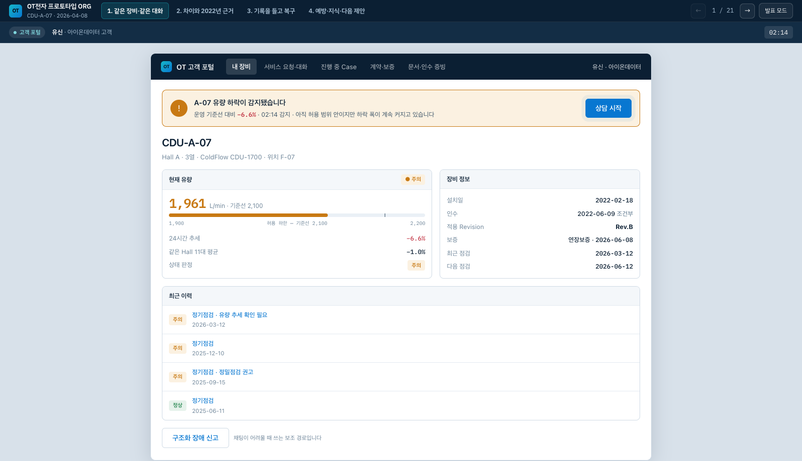
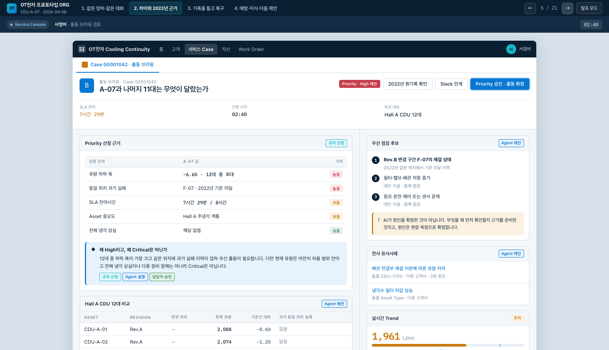
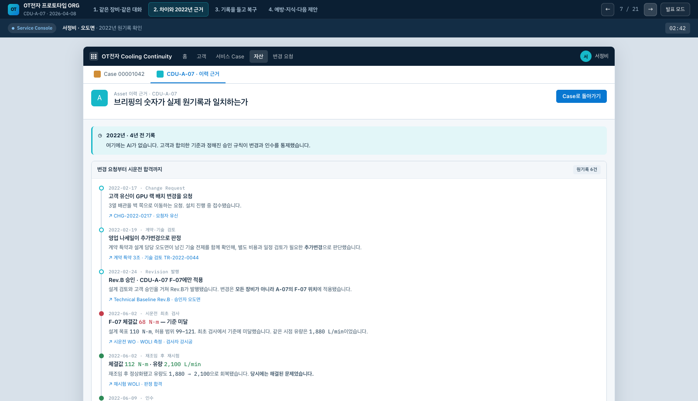
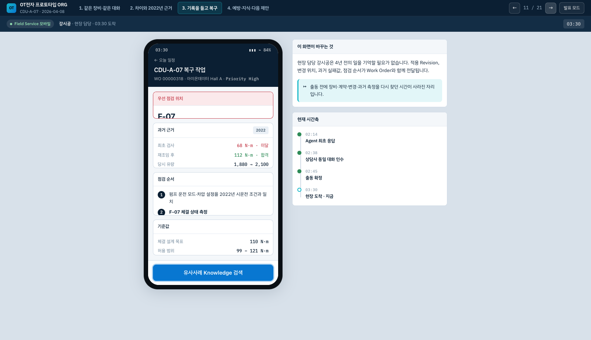
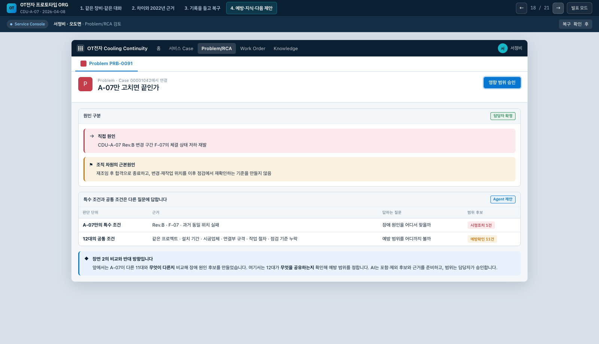
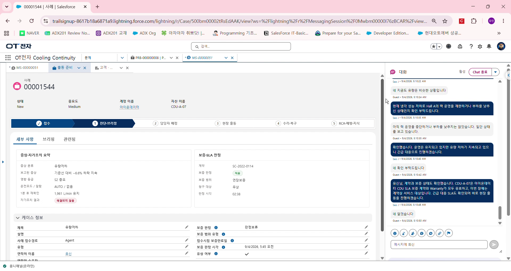
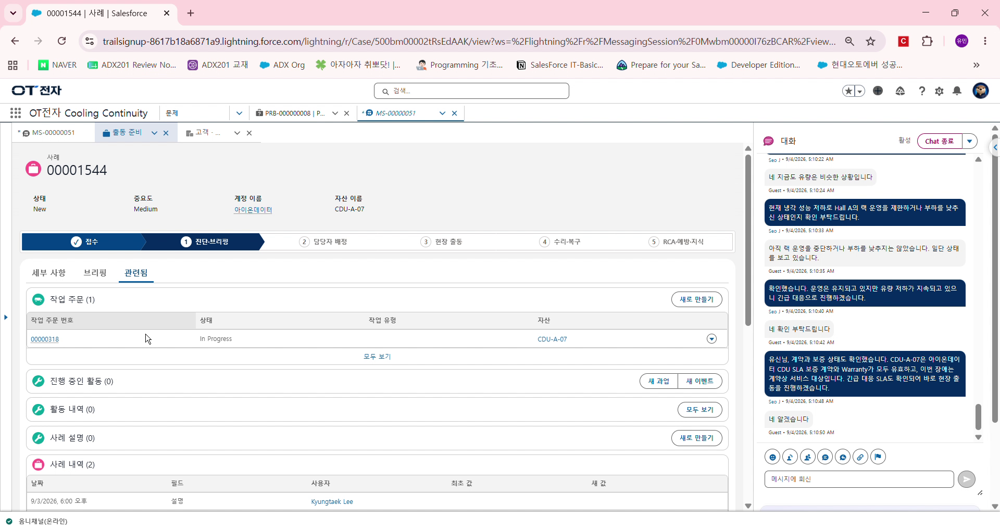

# OT전자 냉각장비 CRM

> 냉각장비의 계약 조건과 설치·시운전 기록을 운영 단계까지 이어, 고객 문의가 들어왔을 때 **현재 상태와 과거 근거를 한 화면에서 확인하고 다음 조치를 결정**하도록 만든 Salesforce CRM입니다.

**6주 · 5인 팀 프로젝트** | Salesforce · Service Cloud · Experience Cloud · Agentforce · Field Service<br>
**담당** | 설치·시운전·인수·보증 자동화 단독 구현, 이후 조기경보·고객 포털·AI 상담을 잇는 운영 고도화 설계 및 구현

이 저장소는 비공개 팀 저장소에서 제가 작성하거나 설계한 메타데이터만 추린 포트폴리오입니다. 파일별 기여 범위는 [CONTRIBUTIONS.md](./CONTRIBUTIONS.md)에 명시했습니다.

---

## 프로젝트가 해결한 문제

OT전자는 데이터센터 냉각장비를 납품하는 가상 제조사입니다. 장비 한 대의 정보가 영업 메일, 계약서, 설계 문서, 설치 기록, 서비스 이력에 나뉘어 있어 다음과 같은 문제가 생겼습니다.

- 고객이 진행 상황을 물으면 영업 담당자가 생산·설계·설치팀에 다시 확인해야 했습니다.
- 현장 담당자는 장애가 난 장비의 변경 위치와 과거 시운전 결과를 출동 전에 찾기 어려웠습니다.
- 장비를 복구한 경험이 같은 모델의 예방점검이나 다음 영업 기회로 이어지지 않았습니다.

이를 `Asset`을 중심으로 연결했습니다.

```text
계약 확정
  → 설계 기준선 스냅샷
  → 설치·시운전 작업 자동 생성
  → 측정값 판정·재시험·인수
  → 보증 자동 개시
  → 장비 이상 감지·고객 상담
  → 출동·복구·RCA
  → 동종 장비 예방조치·재영업
```


외부 PLM·ERP·BMS는 원본 시스템으로 남기고, Salesforce에는 담당자가 판단하고 협업하는 데 필요한 상태·식별자·이력만 연결하도록 경계를 정했습니다.

## 대표 사용자 여정

아래 화면은 실제 org의 객체와 데이터 구조를 바탕으로 만든 **인터랙션 프로토타입**입니다. 여러 레코드 화면을 오가며 설명해야 했던 데모를 하나의 장비 `CDU-A-07` 여정으로 재구성했습니다. 실제 구현 화면은 다음 절에서 별도로 확인할 수 있습니다.

### 1. 고객은 이상을 발견한 화면에서 바로 상담을 시작합니다



고객 포털이 장비별 유량, 기준선 대비 변화, 보증과 최근 정비 이력을 함께 보여줍니다. 상담을 시작하면 선택한 자산의 문맥이 대화에 전달되어 고객이 장비 정보와 증상을 처음부터 다시 설명하지 않아도 됩니다.

### 2. 서비스 담당자는 출동 여부와 우선 점검 위치를 근거와 함께 판단합니다



유량 하락 폭, 동일 위치의 과거 실패, SLA 잔여시간과 자산 중요도는 Flow와 Rule이 계산합니다. Agent는 그 결과를 설명하고 점검 후보를 제안하며, 최종 Priority와 출동은 담당자가 승인합니다.

### 3. 4년 전 변경과 시운전 기록이 현재 장애의 근거가 됩니다



고객 변경요청, 적용 Revision, 변경 위치, 최초 불합격값과 재시험 합격값을 같은 자산에 연결했습니다. 최종 합격값만 남기지 않았기 때문에 현재 장애에서 `Rev.B · F-07 · 68 → 112`라는 구체적인 점검 근거를 찾을 수 있습니다.

### 4. 현장 담당자는 과거 기록과 점검 순서를 Work Order에서 확인합니다



적용 Revision과 변경 위치, 과거 측정값, 점검 순서가 Field Service 작업에 함께 전달됩니다. 현장 담당자가 과거 담당자의 기억이나 별도 문서에 의존하지 않도록 만들었습니다.

### 5. 복구 결과는 예방조치라는 다음 업무로 이어집니다



직접 원인과 조직 차원의 원인을 구분하고, 담당자가 승인한 범위에 따라 시정조치 1건과 동종 장비 예방확인 11건을 만듭니다. 분석 결과가 보고서에 머무르지 않고 담당자와 기한이 있는 후속 작업이 되도록 설계했습니다.

## 실제 Salesforce org 화면

| 서비스 운영 홈 | 고객 포털 장비 상세 |
|---|---|
|  |  |
| 전체 장비, 활성 알림, 유량 추세를 한 화면에서 확인 | 고객 계정에 속한 장비의 상태·게이지·정비 이력을 조회 |

| Agent 상담과 보증·SLA 판정 | Case 단계와 Work Order 연동 |
|---|---|
|  |  |
| 자산·계약 문맥을 확인한 Agent 대화를 상담사가 이어받음 | 접수부터 RCA까지의 상태와 현장 작업을 같은 콘솔에서 추적 |

추가 화면은 [`screenshots/`](./screenshots)에서 볼 수 있습니다.

## 내가 구현한 핵심

### 설치·시운전·인수·보증

| 문제 | 구현 | 사용자에게 보이는 변화 |
|---|---|---|
| 계약 이후 적용 사양이 문서에만 남음 | 계약 활성화 시 `Technical_Baseline__c` Rev.A 스냅샷 생성 | 확정 사양과 이후 변경 Revision을 자산 이력에서 추적 |
| 설치와 시운전의 작업 단위가 다름 | 설치는 자산별, 시운전은 측정항목별 Work Order Line Item 자동 생성 | 담당자가 작업표를 수동으로 다시 만들지 않음 |
| 측정 결과와 재시험 이력이 끊김 | 허용범위 자동 적재 → 합격/불합격 판정 → 불합격 시 재시험 체인 생성 | 최초 실패값과 조치 후 결과를 함께 확인 |
| 잔여 작업이 있는데 다음 단계로 넘어감 | Punch 상시 집계, 증빙 검사, 단계별 Handoff Gate | 완료조건을 충족해야 인수 단계로 이동 |
| 인수일을 다시 저장할 때 보증일이 달라질 수 있음 | 조건부인수 시 보증 기산일을 한 번만 기록 | 보증 시작일의 불변성 보장 |

이 구간은 Record-Triggered Flow 17개와 Validation Rule로 구현했습니다. 대표 흐름은 `Technical_Baseline_Rev_A`, `WOLI_Judgement_AutoSet`, `WOLI_Retest_Create`, `Asset_Warranty_On_Acceptance`입니다.

### 운영 고도화

| 기능 | 구현 방식 |
|---|---|
| 장비 조기경보 | `IoT_Reading__e` Platform Event → WOLI 기록 → 추세 판정 → Asset 요약 동기화 |
| 고객 포털 | Experience Cloud + 계정 범위 조회 Apex + 장비 홈·상세·게이지 LWC |
| 통합 Service Agent | 고객/내부 Topic 분리, 자산·계약·Knowledge·Case 처리를 위한 Invocable Apex Action 6종 |
| 상담사 이어받기 | MIAW 세션과 Case를 같은 콘솔에 고정하고 자산 문맥을 전달 |
| 현장·협업 연결 | Work Order, Field Service, Slack Swarm을 Case 흐름에 연결 |

## 구현 중 내린 주요 결정

### 보증 시작일은 조건부인수 시점에 한 번만 기록

인수는 조건부인수와 최종인수로 나뉩니다. 최종인수 때마다 보증 시작일을 다시 쓰면 잔여 작업이 늦어질수록 회사의 보증 부담도 임의로 바뀝니다. 최초 조건부인수 시점만 기록하고 이후 저장에서는 바꾸지 않는 Flow 조건을 두었습니다.

### 포털이 조회할 수 없는 원본은 Asset 요약으로 제공

이 org의 Customer Community 라이선스에서는 `WorkOrderLineItem`에 객체 권한을 부여할 수 없었습니다. 권한을 넓히는 우회 대신, 원본 변경 시 필요한 게이지와 최신 추세만 `Asset` 요약 필드에 동기화했습니다. 포털 사용자는 자신의 계정에 속한 Asset만 `WITH USER_MODE`로 조회합니다.

### Agent의 제안과 담당자의 결정을 분리

Priority, 점검 위치, 예방 범위는 Agent가 근거와 후보를 준비하지만 담당자가 승인합니다. Case의 현장 완료 알림만으로 자동 종결하지 않고, 고객 복구 확인과 RCA가 끝나야 다음 단계로 이동하도록 했습니다.

### 실패값을 정상값으로 덮어쓰지 않음

시운전 불합격과 재시험 합격을 별도 Line Item 체인으로 남겼습니다. 과거에 해결된 실패가 몇 년 뒤 장애의 위치를 좁히는 근거가 될 수 있기 때문입니다.

## 구조와 규모

```text
force-app/main/default/
├── flows/                  # 설치·인수·운영 자동화 23개
├── classes/                # Apex 19개 + 테스트 클래스 8개
├── lwc/                    # 고객 포털·운영 홈·상담 콘솔 UI 47개
├── aiAuthoringBundles/     # OT Service Agent
├── genAiPromptTemplates/   # 상담 답변·Case 종결 요약
├── digitalExperiences/     # Experience Cloud 사이트
└── objects/                # 담당 범위의 커스텀 필드·검증 규칙
```

- 시스템·데이터 구조: [`docs/T5_시스템아키텍처.md`](./docs/T5_시스템아키텍처.md), [`docs/diagrams/`](./docs/diagrams)
- 통합 Service Agent: [`docs/T5_통합_Service_Agent_구조.md`](./docs/T5_통합_Service_Agent_구조.md)
- 실시간 알림: [`docs/T5_실시간알림_구조.md`](./docs/T5_실시간알림_구조.md)
- 설계 기록: [`docs/ADR-T5-00-integrated-loop.md`](./docs/ADR-T5-00-integrated-loop.md)
- 기능별 명세: [`docs/specs/`](./docs/specs)

## 검증과 범위

- Apex 테스트 클래스 8개, 테스트 메서드 48개로 자산 조회 범위, 조기경보 요약, Agent Action, 포털 알림 확인 등을 검증했습니다. (2026-09-11 연결 org 기준 48/48 통과)
- 화면의 회사명·고객명·수치와 성과 시간은 프로젝트 데모용 가상 데이터입니다.
- 팀 전체 시나리오 중 RCA 워크벤치·Customer 360·출동 브리핑의 일부는 다른 팀원 구현입니다. 이 저장소에는 제 구현 파일만 포함했습니다.
- 다른 트랙이 만든 객체와 필드를 참조하므로 이 저장소만으로 단독 배포하는 패키지는 아닙니다.

## 기술 스택

Salesforce Platform · Service Cloud · Experience Cloud · Field Service · Agentforce · MIAW<br>
Flow · Apex · LWC · Platform Event · Custom Metadata Type · Prompt Template<br>
SFDX · GitHub Actions · Slack
