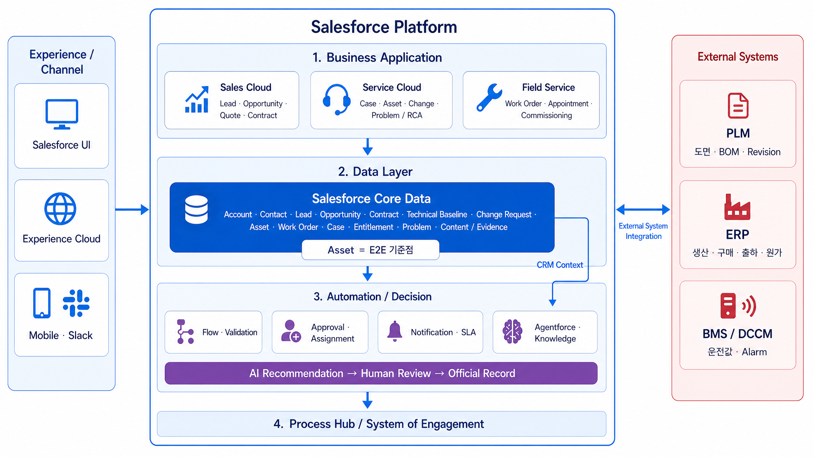
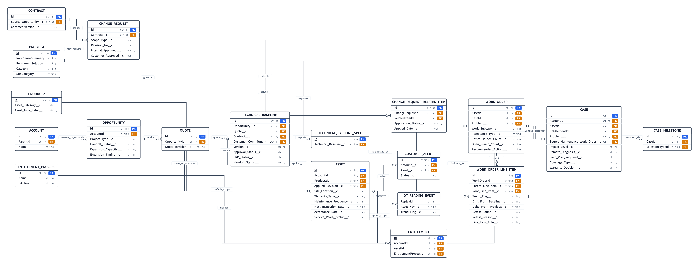
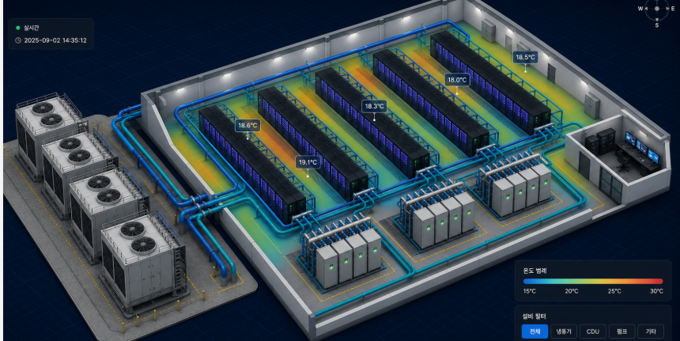
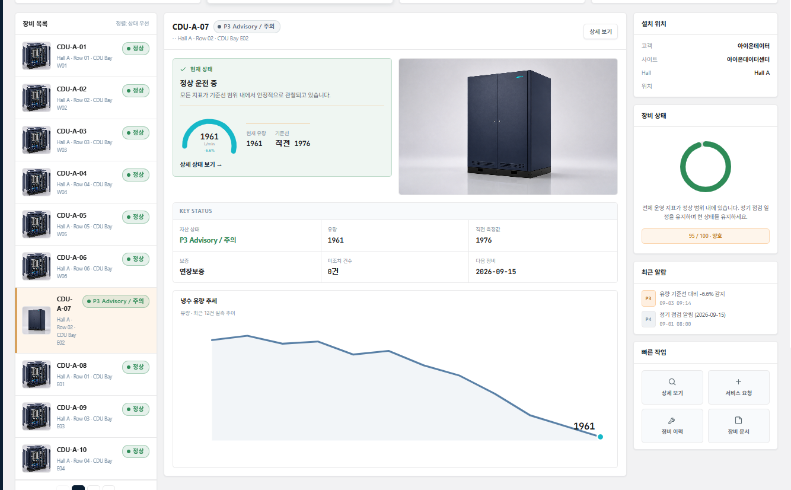
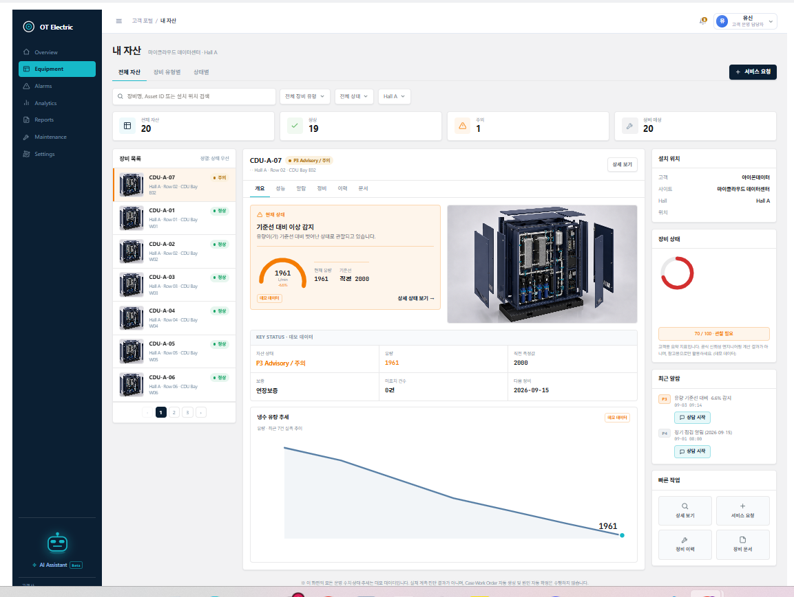

# OT전자 냉각장비 CRM

> AI 데이터센터용 냉각장비를 **제조 → 설치 → 인수 → 운영 → 재영업**하는 가상 기업 **OT전자**의
> 리드부터 사후 운영까지를 잇는 Salesforce End-to-End CRM.
>
> **6주 · 5인 팀 부트캠프 프로젝트** (AI CRM 2기). 저는 **구축·인수(T3) 트랙을 담당**했고,
**AI 운영 고도화(T5) 이니셔티브를 주도**했습니다.
>
> 이 저장소는 팀 저장소(`sf-team-1to10/ot-cooling-crm`, 비공개)에서 **제가 작성·설계한 컴포넌트만** 추출한 것입니다. (→ [CONTRIBUTIONS.md](./CONTRIBUTIONS.md)) 전체 프로젝트의 맥락 안에서 제 기여가 어디에 위치하는지 아래에 정리했습니다.

---

## 1. 어떤 프로젝트인가

### 회사와 문제

OT전자는 데이터센터에 들어가는 **냉각장비(CDU·냉각분배장치 등)를 만들어 파는 회사**입니다. 문제는 "장비를 팔고 나면 그 다음이 시스템에 안 보인다"는 것이었습니다.

| 단계 | As-Is 문제 |
|---|---|
| 영업 → 계약 | 리드·견적·제안이 이메일과 엑셀에 흩어져 유입 채널·전환율이 안 보임 |
| 계약 → 설계 | 계약이 확정돼도 **"무슨 스펙으로 만들고 시운전할지"(설계 기준선)**가 시스템에 없어 매번 문서를 찾음 |
| 설치 → 인수 | 잔여 작업(Punch)·재시험이 엑셀 관리 → 인수 판정이 담당자 감(感)에 의존 |
| 인수 → 운영 | 장비 이상이 **사고가 터진 뒤에야** 접수됨. 사전 경보 없음 |
| 운영 → 재영업 | 계약 만료·가동률 데이터가 영업으로 연결 안 됨 |

### 목표

리드 → 영업 → 계약 → **설계 기준선 → 생산·설치 → 시운전 → 인수(조건부→최종) → 보증 개시** → 운영(예방정비·장애복구) → 재영업(증설)의 전체 여정을 **하나의 데이터 체인**으로 잇는 것.

### 시스템 아키텍처 (직접 설계)



Salesforce Platform을 4계층(Business App / Data Layer / Automation·Decision / Process Hub)으로 구조화하고, `Asset`을 E2E 기준점으로 잡았습니다. 외부 시스템(PLM·ERP·BMS/DCCM)은 이번 범위에서 필드만 두고 실연동은 트리거 조건으로 미뤘습니다(§4-③). ERD는 [`docs/diagrams/`](./docs/diagrams) 참고.

### 팀 구성 — "누가 어떤 객체를 소유하는가"로 트랙 분리

업무(Use Case)가 아니라 **객체 소유권**으로 5개 트랙을 나눴습니다. 하나의 업무 흐름이 여러 객체를 가로지르기 때문에, UC로 나누면 여러 사람이 같은 객체를 건드리게 되기 때문입니다.

| 트랙 | 소유 영역 |
|---|---|
| **T0 플랫폼** | 공통 객체 골격·권한(Permission Set)·CI 파이프라인·크로스트랙 Lookup |
| **T1 영업** | Lead · Opportunity · Quote · 견적/제안/협상 |
| **T2 변경관리** | 리비전·업그레이드·변경 요청 |
| **T3 구축·인수 (담당)** | Technical Baseline · WorkOrder · WorkOrderLineItem · 시운전·인수·보증 |
| **T4 운영·AI** | Case · Problem · 예방정비 · Agentforce · 출동 브리핑 |
| **T5 고도화 (주도)** | 가상 IoT · 조기경보 · 통합 Service Agent · 고객 포털 · Slack 협업 · FSM |

## 2. 대표 데모 시나리오 (전체 여정)

`CDU-A-07` 장비 한 대가 시나리오 전체를 관통합니다.

```
계약 체결 → Technical Baseline(설계 기준선) 스냅샷 → ERP 발주        [T3]
  → 설치 WorkOrder → 자산별 라인아이템 자동 생성                     [T3]
  → 시운전 WorkOrder → 측정 → 합격/불합격 자동 판정 → 재시험 체인     [T3]
  → Punch(잔여작업) 집계 → 핸드오프 게이트(D1→D2→D6)                [T3]
  → 조건부인수 시점에 보증 기산 + 보증·서비스계약 자동 생성           [T3]
  ─────────────────────  운영 단계  ─────────────────────
  → 가상 IoT 센서값 수신 → 추세 이상 감지 → Trend 조기경보           [T5]
  → 고객이 포털에서 게이지·이력 확인 → 상담 진입(MIAW 실시간 채팅)     [T5]
  → 통합 Service Agent 1차 응대(자산 컨텍스트 + Knowledge) → 서비스팀 이관 [T5]
  → Case 생성 → Customer 360(계약·제품·문제 이력) → 출동 브리핑        [T4/T5]
  → 복합 이슈 시 Slack Swarm 채널 자동 개설·전문가 초대·요약 게시      [T5]
  → Field Service 모바일 출동 → 원인 분석(RCA) → 현장 조치            [T5]
  → Knowledge Article 자동 생성 순환 + 동종 장비 수평 예방            [T5]
  → 계약 만료·가동률 기반 증설 제안 → 재영업                          [T5]
```

## 3. 이 여정에서 내가 담당한 부분

```
리드─영업─계약─┃━ 설계 기준선 ━ 생산·설치 ━ 시운전 ━ 인수 ━ 보증 ┃━ 운영 ━ 재영업 ─
  (T1)  (T1) (T1)┃◀────────────── T3 구축·인수 (단독) ──────────────▶┃◀── T5 고도화 (주도) ──▶
```

- **T3 (단독)** — 계약 확정 이후 "설계 기준선 → 시운전/인수 → 보증 개시"의 **데이터 체인과 결정적 자동화** 전부. Flow 23개가 이 구간의 뼈대입니다.
- **T5 (주도)** — 발표 범위 밖에서 운영 단계의 "가상 IoT → 조기경보 → 협업 → AI 상담 → 현장 → 재영업" 통합 루프를 ADR로 설계하고, 이후 팀 분업(트랙 A~E 백로그·주말 분업표)으로 확장. Apex 19 · LWC 48.

아래 ERD가 제 담당 구간입니다 — Technical Baseline · WorkOrder · WOLI(`Trend_Flag__c` / `Drift_From_Baseline__c`) · IoT_Reading_Event · Customer_Alert · Case · Entitlement (직접 설계):



[전체 여정 Object ERD →](./docs/diagrams/03_전체여정_Object_ERD.svg)

### T3 — 구축·인수 트랙 (단독)

| 구간 | 만든 것 |
|---|---|
| 기준선 | `Technical_Baseline__c` 필드 설계 + `Technical_Baseline_Rev_A` — **Contract가 `Activated`(법적 구속력 발생)되는 시점의 스냅샷**으로 Rev.A 생성 |
| ERP 연계 | `Baseline_Approve_ERP_Order` — 승인 시 발주 상태 전이 (Fast Field Update) |
| 작업 자동화 | `WO_Install_LineItem_AutoCreate`(설치: 자산 1대당 1줄) / `WO_Commission_LineItem_AutoCreate`(시운전: 측정항목 1건당 1줄) — 같은 WorkOrder라도 **업무 성격에 따라 라인아이템 생성 축이 다름** |
| 시험·판정 | `WOLI_Baseline_Spec_AutoLoad`(적용 리비전 → 허용범위 자동 적재) · `WOLI_Judgement_AutoSet`(측정값 → 합격/불합격) · `WOLI_Retest_Create`(불합격 → 재시험 체인) |
| Punch 관리 | `WOLI_*_Open_Punch_Recalc` 상시 집계 + `Punch_Overdue_Task_Daily` 기한 초과 자동 노출 + Validation Rule(검증완료 시 검증자 필수) |
| 핸드오프 게이트 | `TB_D1_D2_Handoff` · `WorkOrder_Evidence_Check` · `WorkOrder_D6_Task_On_Completion` — 완료조건 미충족 시 다음 단계 진입 차단 |
| 보증 자동화 | `Asset_Warranty_On_Acceptance` — **조건부인수 시점에 보증 기산일을 1회 기록, 최종인수로 재저장돼도 재기록 안 함** (§4-①) |

### T5 — AI 운영 고도화 (주도)

| 축 | 만든 것 |
|---|---|
| 가상 IoT · 조기경보 | `IoT_Reading__e` Platform Event → `T5_IoT_Reading_Subscribe` → WOLI 기록 → `Trend_Flag__c` 추세 판정 → `T5_Sync_Asset_Trend_Summary`. `OtTrendAlertCardController` + 게이지 위젯 |
| 고객 포털 (Experience Cloud) | `T5HmiAssetHomeController` / `T5HmiAssetDetailController` + `otEquip*` / `otMyAssets` / `otAssetPortal` — 고객이 자기 장비 상태·이력·게이지 확인 후 상담 진입 |
| 통합 Service Agent (Agentforce) | `bots/OT_Service_Agent` + `aiAuthoringBundles` — 고객·내부 상담을 **하나의 에이전트 + Topic 분리**로 처리. `T5Agent*Action` 6종(자산 컨텍스트 / Case 인테이크 / 계약 컨텍스트 / Knowledge 검색 / 답변 추천 / Case 종결 요약) + `genAiPromptTemplates` 2종 |
| AI 자동 응답 추천 | `T5AgentReplySuggestionAction` + `Agent_Reply_Suggestion` 프롬프트 템플릿 + `otAgentSuggestedReply` / `t5ServiceReplies` — 상담사가 답변 초안을 한 번 더 검증해 발송 |
| MIAW 실시간 채팅 | `messagingChannels/OT_Service_Chat` + `EmbeddedServiceConfig` + `Route_Inbound_to_Agent` / `Route_to_Messaging_Queue` Flow + `Messaging_Session_Pinned/Record_Page` FlexiPage + `otMsSidebarLeft`·`otMsSidebarCenter`·`otMsConvBanner`·`otCaseSubtabOpener` — MessagingSession 좌측 고정 + Case 서브탭 자동 오픈, 1차 Agent → 2차 상담사 **같은 대화 이어받기** |
| Slack 협업 · FSM | 담당자 확정 → Slack Swarm 채널 자동 생성·초대·요약, FSM 모바일 배정 연동 + SA/WO 상태 동기화 |
| 운영 홈 | `OTOpsHomeController` + `otCooling*` / `coolinxOverview` / `otEquip*` / `OtTrendAlertCard` + 게이지 LWC — 데이터센터 3D 디지털 트윈·KPI·유량 추세 |
| 영업(Opportunity) 홈 | `OtSalesDashboardController` / `OtSalesSidebarController` + `dashboards/OT_Sales_Dashboard` + `reports/OT_Sales/` 4종(Pipeline_By_Stage·Key_Deals·Quarterly) + `otSales*` LWC 15종 — 분기 실적·파이프라인·서비스계약 만료 관리 |

## 4. 핵심 의사결정

"무엇을 만들었나"보다 **"왜 이 선택을 했나"**. 가장 자신 있는 부분입니다.

**① 보증 기산일 불변성**
인수는 조건부인수(사소한 잔여 작업이 남아도 고객이 일단 받아들이는 시점) → 최종인수 2단계입니다. "보증 시작일 = 최종인수일"로 잡으면, 잔여 작업이 늦어질수록 보증 시작일도 밀려 **회사가 자기 지연 때문에 보증 부담을 스스로 키우게 됩니다.** 그래서 보증 기산일은 조건부인수 시점에 딱 한 번 기록되고, 이후 레코드가 재저장돼도 재기록되지 않도록 설계했습니다 — 이 불변성 자체가 완료조건의 핵심.

**② Technical Baseline = 계약 확정 시점의 스냅샷**
아직 협상 중일 수 있는 `Quote`·`Customer_Commitment__c` 기준으로 기준선을 만들면 안 됩니다. **`Contract.Status`가 `Activated`로 바뀌는 순간 = 법적 구속력이 생기는 확정 시점**이고, 기준선은 정확히 이 시점의 스냅샷이어야 합니다.

**③ Clicks-before-Code를 "미리 계획"이 아니라 "트리거 조건"으로 관리**
백로그의 모든 요구사항이 Flow·Validation Rule로 커버되고, 진짜 코드가 필요한 이유(복잡한 대량 처리, 동기 외부 콜아웃, 표준 화면 불가 UI)가 없다면 커스터마이징 단계를 미리 넣지 않았습니다. 대신 "이 조건이 오면 그때 논의"라는 트리거(예: 실제 ERP/BMS 연동 승인)만 정의. 발표 트랙에서 Agentforce·포털(T3-22~25)을 보류한 것도 "자동화 기반이 갖춰진 뒤에야 그 위 레이어가 의미 있다"는 이 원칙의 적용입니다.

**④ "예방"에는 두 축이 있다**
팀은 "예방 기능이 없다"고 봤지만, 정확히는 **수평적 예방**(사고 후 동종 장비 확산 방지 — 이미 있음)과 **수직적 조기경보**(사고 전, 추세만으로 트리거 — 없음)로 나뉩니다. T5의 IoT → Trend 루프가 후자를 채우는 것으로 범위를 정확히 정의했습니다.

**⑤ org 실측은 Tooling API 우선**
진단 계정에 FLS가 없으면 `sf sobject describe`·일반 SOQL이 "필드 없음"이라는 **거짓 음성**을 냅니다(실제로는 배포·Active인데). Tooling API(`CustomField`, `FieldPermissions`, `FlowDefinitionView`)는 FLS와 무관하게 메타데이터 존재를 보여줘 이걸 기준으로 삼았습니다.

## 5. 팀 협업 구조

- **트랙 = 객체 소유권** (§1). 하나의 UC가 여러 객체를 가로지르므로, UC 단위로 나누면 충돌이 난다는 판단.
- **GitHub 경유 + 개인 Sandbox 분리** — Salesforce는 클릭이 즉시 org에 반영되는 시스템이라 여러 명이 같은 org를 동시에 손대면 덮어씀. 그래서 메타데이터를 XML로 git 관리하고, 각자 개인 Sandbox에서 개발.
- **git worktree로 5개 병렬 트랙** — 하나의 저장소에서 트랙별 브랜치를 별도 폴더로 체크아웃해, 파일 겹침·merge 대기를 관리.
- **공유 메타데이터의 함정** — `Permission Set`처럼 여러 트랙이 한 파일을 공유하면, 필드 하나만 추가해도 CI가 파일 전체(다른 트랙 몫 포함)를 검증 대상으로 끌어와 실패할 수 있음. "내가 고친 부분만 영향받는다"는 직관이 안 통한다는 걸 사고로 배움.

## 6. 기술 스택

Record-Triggered Flow · Screen Flow · Fast Field Update · Validation Rule · Approval Process ·
Apex (Invocable Action / Controller / Trigger Handler) · Lightning Web Components ·
Platform Event · Custom Metadata Type · Agentforce (Topic / Action) · Experience Cloud ·
Service Cloud for Slack (Case Swarming) · Field Service · SFDX · GitHub Actions CI

**협업 도구**: Agentforce Vibes · Claude Code — AI 페어링으로 트랙 단독 구축. 설계·의사결정·검증은 직접.

## 7. 문서

- [T3 시스템이해노트](./docs/T3_시스템이해노트.md) — 플랫폼 동작 원리·배포 구조·트랙 협업 설계
- [T3 학습정리](./docs/T3_학습정리.md) — Flow/도메인 노하우
- [T5 시스템 아키텍처 총정리](./docs/T5_시스템아키텍처.md) · [통합 Service Agent 구조](./docs/T5_통합_Service_Agent_구조.md) · [실시간 알림 구조](./docs/T5_실시간알림_구조.md)
- [ADR-T5-00 통합 루프 MVP](./docs/ADR-T5-00-integrated-loop.md) · [T5 A~E 스펙](./docs/specs)
- [다이어그램 (시스템 아키텍처 · ERD, 직접 설계)](./docs/diagrams)

## 8. 화면

| 운영 개요 대시보드 | 데이터센터 3D 디지털 트윈 |
|---|---|
|  |  |

| 장비 상세 (게이지·이력) | 고객 포털 "내 자산" |
|---|---|
|  |  |

전체: [`screenshots/`](./screenshots) · 상담사 콘솔(MIAW)·Agent 상담·RCA 워크벤치는 데모 영상 예정.

## 9. 이 저장소에 대해

- **단독 배포 대상이 아닙니다.** 팀 저장소에서 제 작업만 추출했기 때문에, 다른 트랙이 만든 오브젝트·필드를 참조하는 부분이 있습니다. 코드·설계를 보여주기 위한 것입니다.
- 표준 객체(`Case`, `WorkOrder` 등) 폴더에는 **제가 추가한 커스텀 필드만** 포함했습니다.
- 팀원 이름·내부 논의 문서는 제외/치환했습니다.
