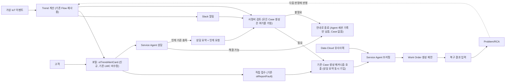
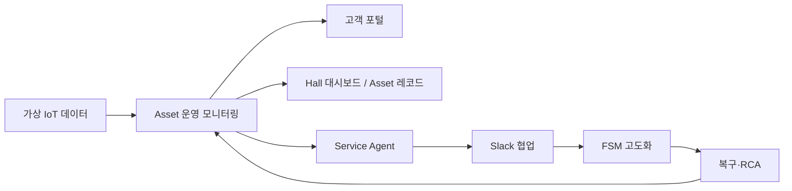

# ADR-T5-00 — T5 통합 서비스 폐루프 MVP

> 상태: **초안 (Draft) — 사용자 확정 대기**
> 작성: Claude Code (grill-with-docs 세션), 2026-08-26
> 짝 문서: 이후 `ot-cooling-crm 개발/t5/specs/T5-*.md` (Epic별 상세 명세), `ot-cooling-crm 개발/t5/backlog/` (PR 단위 티켓)
> 이 문서는 **결정 기록**이다. 실행 계획이 아니라 "무엇을 왜 이렇게 정했는가"를 남긴다.

---

## 1. 배경

기존 `T5_고도화_v1_범위축소.md`(13개 Task, 좁은 범위)는 `T5_고도화_v1_범위축소.md`로 아카이브했다.

**T5의 본체는 사용자가 직접 지정한 5개 기능 축이다** — 가상 IoT 연동 Asset 운영 모니터링, 고객 포털, Service Agent, Hall 대시보드/Asset 운영 레코드, Slack 협업·FSM 고도화. Trend Flag 계산, Case 전환 규칙, Data Cloud, 예방 체크리스트, 알림 채널 같은 항목은 **이 5개 축을 연결하기 위해 파생된 설계·구현 항목**이지 그 자체가 목표가 아니다.

> **T5 목표**: 가상 IoT 데이터를 기반으로 Asset 운영 상태를 모니터링하고, 그 상태를 고객 포털·Asset 운영 레코드·Hall 대시보드에서 역할별로 보여주며, Service Agent·Slack 협업·Field Service Mobile을 통해 고객 문의와 이상 징후가 사람의 판단·현장 복구·RCA까지 이어지는 운영 고도화 MVP를 구현한다.

이전 초안의 "가상 IoT → Trend → Slack → Case → Agent → WO"라는 단일 선형 폐루프 표현은 기술 흐름 설명으로는 여전히 유효하지만, **T5가 무엇을 위한 것인지(Why)는 아래 5개 축**이 우선한다.

T5는 **T0~T4 기준선을 수정·대체하지 않는 선택적 확장(Plus-Alpha)**이다. Feature Flag로 켜고 끌 수 있어야 하고, 꺼도 기존 QA가 그대로 통과해야 한다.

**T5는 기존 공식 서비스 흐름(고객의 Asset 기반 장애 접수 → Case 생성 → 그 시점에 보증 스냅샷·SLA 시작)을 변경하지 않는다.** Service Agent·Slack·가상 IoT·Data Cloud는 이 흐름의 앞단 입력 보조·근거 제공·사람 간 인계·검색을 추가할 뿐, Case 생성·SLA 시작·출동·Work Order·Case Close의 기준 시점과 책임자는 그대로 둔다. Agent 상담도 예외가 아니다 — 상담이 인계 기준을 충족하면, 새로운 접수 모델을 만드는 게 아니라 **기존 Case 생성 메커니즘을 그 시점에 호출**해 상담 요약과 함께 Case를 만든다.

### 1-1. 원문(`고도화논의제안_v2.md`) 대조 — 무엇이 필수고 무엇이 확장인가

원문 종합정리가 항목을 스스로 등급 매겨뒀다. 이 ADR은 그 등급을 그대로 따른다.

- **필수(시나리오가 이것 없이는 원래 계획대로도 안 돌아감)**: 출동 브리핑 배포, `Trend_Flag__c` 계산 Flow 활성화, 비교 데이터 시딩 → T5-0
- **확장 제안(원문이 스스로 "완전 신규 장면 추가"라고 표현)**: 데모2 Slack 에스컬레이션(스웜), 데모4 Hall 대시보드, 데모5 음성 브리핑·라이브 영상, **데모6 통합 Service Agent**
- 원문은 통합 Service Agent에 대해 "데모1 Case 접수 채널과 데모2 Slack 에스컬레이션이 **먼저 끝나야** 재사용할 대상이 생긴다 — 순서상 가장 나중"이라고 명시 → 이 ADR의 Epic 순서(T5-3 Slack → T5-4 Agent)는 이 지침을 따른 것이다.
- Field Service Mobile은 "강시공이 WO 알림을 어떤 채널로 받는지 자체가 미정"이라는 **열린 결정**으로 남아 있었다(확장 제안 목록엔 없음) — 이번 ADR 초안에서 한 번 누락됐다가 재검토 후 T5-6에 다시 포함했다.

---

## 2. 실측으로 확인된 사실 (org·저장소 직접 조회, 2026-08-26)

작업 전제를 문서가 아니라 **T3DLV(vscodeOrg)와 T0(T0INT) 조회**로 확인했다.

### ⚠️ 2026-08-26 재조사 — REST Describe/SOQL은 FLS 때문에 거짓 음성을 냈다

아래 표의 초판은 `sf sobject describe`·SOQL(REST API, 제 진단용 계정 기준)로 만들었는데, 이 계정에 T5 관련 필드 FLS가 하나도 할당돼 있지 않아서 **"필드가 org에 없다"는 결론이 다수 틀렸다.** Tooling API(`SELECT ... FROM CustomField`, `FieldPermissions`)는 FLS와 무관하게 메타데이터 존재 자체를 보여줘서 이걸로 재확인했다. 실제 서비스 담당자용 Permission Set(`PS_Service`)엔 해당 필드 FLS가 이미 있어서, **실제 사용자는 처음부터 정상적으로 볼 수 있었을 가능성이 높다** — 문제는 시스템이 아니라 제 조회 계정이었다.

| 항목 | 초판 결론(REST, 틀림) | 재확인(Tooling API, 2026-08-26) |
|---|---|---|
| `WorkOrderLineItem.Trend_Flag__c` | org에 없음 | **존재함**(T0 트랙 담당자, 2026-08-21 생성). `PS_Service`에 FLS Read 있음 |
| `WOLI_Trend_Flag_Evaluate` Flow | Active(맞았음) | Active 재확인 — **필드도 있고 Flow도 Active라 정상 작동 중이었을 가능성 높음** |
| `Case.Dispatch_Briefing__c` | org에 없음(브랜치 미merge라 없을 거라 추정) | **존재함**(2026-08-26 오늘 생성!). git엔 아직 미merge지만 **T0 sandbox엔 이미 직접 배포돼 있음**(merge와 sandbox 배포는 별개였음) |
| `Case_Dispatch_Briefing_Generate` Flow | 없음(브랜치 미merge라 추정) | **Active**. Trend Flag와 마찬가지로 이미 정상 작동 중 |
| `WorkOrder.Dispatch_Briefing__c`(옛 버전) | org에 없음 | 존재하지만 관련 Flow 비활성 — 옛 버전이라 안 쓰면 됨(이 결론은 유지) |
| `PRI_Corrective_Preventive_WO_Dispatch` Flow | Active | Active(재확인, 변화 없음) |
| CDU-A-05/06/08 비교 데이터 | 존재 (3건) | 존재 (3건, 변화 없음) |
| Experience Cloud "OT전자 고객 포털" | Live, LWC 4종 작업 중 | 변화 없음(3-2장 그대로) |

**교훈**: 앞으로 T0 실측은 REST Describe/SOQL 대신 **Tooling API(`CustomField`, `FieldPermissions`, `FlowDefinitionView`)를 우선 쓴다.** 내 진단 계정에 FLS를 맞춰 넣는 것도 검토(하지만 진단용으론 Tooling API로 충분).

### 정정된 판단

- `Trend_Flag__c`는 `WorkOrderLineItem`(T3 소유 객체) 위에 **T4가 추가한 필드**다(`feat(T4-07)` 커밋). 객체는 T3 것이어도 필드는 T4 소유 — T0 배포 전 T4 담당자 확인 필요.
- 로직(하락률·연속 하락 규칙, `Trend_Threshold__mdt` 임계치 참조)은 이미 잘 설계돼 있다. **T5는 이 로직을 복제/분리하지 않고 그대로 재사용**한다. T5가 할 일은 판정 로직이 아니라, 이 로직이 참조하는 `WorkOrderLineItem`을 가상 IoT 이벤트가 자동 생성하도록 만드는 입력 경로다.
- 포털은 정적 목업이 아니라 **실제로 진행 중인 작업**이었다. T5는 기존 4개 LWC를 수정하지 않고, 그 위에 새 컴포넌트만 추가하는 방식으로 다시 포함한다 (9.5장).

---

## 3. T5 운영 원칙 — Plus-Alpha

```
T0~T4 = 기준선(Baseline). 기존 업무 흐름·데이터 모델·Flow·QA는 T5가 바꾸지 않는다.
T5 = 선택 가능한 확장. 별도 레코드·Flow·권한·Feature Flag로 얹는다. 꺼도 기준선은 그대로 동작한다.
```

| 영역 | T5에서 해도 되는 것 | T5에서 피해야 할 것 |
|---|---|---|
| 기존 객체 | 새 선택 필드, 새 조회용 필드 | 기존 필수 필드 삭제·의미 변경 |
| Flow | 새 T5 전용 Flow 추가. 기존 Flow의 **업무 규칙은 임의 변경 안 함**, 다만 T5가 의존하는 Flow(예: `WOLI_Trend_Flag_Evaluate`)는 필요한 필드·메타데이터가 함께 배포돼 실제 실행되는지 검증하고, 정합성 결함(2장의 "Active인데 필드 없음" 같은 경우)이 나오면 T4 소유자와 별도 변경요청으로 수정 범위를 합의 | 로직 임의 편집, 소유자 확인 없이 필드만 조용히 배포 |
| Trend_Flag__c | T0 배포(T4 확인 후), 있는 그대로 사용 | 판정 로직 분기·중복 필드 생성 |
| 포털 | 기존 4개 LWC 위에 새 컴포넌트 1개만 추가 | 기존 LWC 소스 수정, 페이지 배치를 리뷰어 승인 없이 확정 |
| Slack | T5 전용 채널·Flow | 기존 Case/Change 흐름을 Slack에 종속시킴 |
| Agent | 조회·제안·브리핑만 | Case/WO 상태를 Agent가 자동 확정 |
| Data Cloud | 소량 복제본/검색 PoC | Salesforce 원본을 Data Cloud에 종속 |

### 3-2. 포털 — 개발 격리 / 통합 책임 분리

"나중에 충돌 나면 해결"을 무계획으로 두지 않기 위해 **개발 단계**와 **통합 단계**의 책임을 명확히 나눈다.

| 구분 | 지금 (T5 개발 단계) | 채택/통합 시점 |
|---|---|---|
| 기존 LWC | 수정하지 않음 | 필요 시 T0 트랙 담당자와 함께 수정 |
| Experience Builder 페이지 배치 | 변경하지 않음 | 카드 위치·메뉴·모바일 레이아웃 합의 후 배치 |
| `otTrendAlertCard` | 별도 LWC로 독립 개발, 데이터 계약은 `@api assetId`(또는 URL state)만 받아 기존 컴포넌트 내부 구현에 의존하지 않음 | 기존 `otMyAssets`/`otAssetPortal` 적절한 위치에 삽입 |
| Service Agent 진입점 | 독립 버튼/별도 페이지에서 검증 | 기존 포털의 "도움 요청"/Asset 상세에 연결 |
| Case 접수 | 기존 `otReportFault`와 **동일한 Case 생성 메커니즘**을 호출(신규 로직 안 만듦) | Agent 상담 결과를 기존 위저드 필드 초안으로 연결 |
| 권한 | T5 전용 Permission Set·Test User로 검증 | 기존 고객 권한·Sharing Set과 회귀 QA |
| 배포 | 개인 Sandbox·로컬 브랜치 | 팀 합의 후 별도 통합 PR |

**핵심**: T5는 기존 포털의 대체 버전을 만드는 게 아니라, 기존 포털이 나중에 가져다 쓸 수 있는 보조 기능을 먼저 독립적으로 만든다. 지금은 기존 4개 LWC의 데이터·권한·접수 Flow를 **읽기 전용으로 파악**하는 것만 필요하고(코드 수정도, 동의도 불필요), 실제 통합 시점에만 T0 트랙 담당자와 페이지 위치·공개 데이터·접수 흐름·권한·모바일 UX·배포 책임을 조정한다.

---

## 4. 갱신된 서비스 폐루프 — 두 개의 진입 경로

Case가 하나의 경로(직접 접수)로만 열리는 게 아니라, **포털에 Agent 상담이라는 두 번째 진입 경로**를 병렬로 둔다. Agent는 Case를 자동 확정하지 않고, "담당자 확인 필요" 판단까지만 하고 서정비에게 넘긴다.



포털은 기존 4개 LWC(`otMyAssets`/`otAssetPortal`/`otReportFault`/`otPortalHeader`)를 **수정하지 않고**, Trend 변화를 보여주는 새 카드 컴포넌트와 Agent 상담 진입점만 T3DLV에서 개발한다. 기존 페이지에 이 컴포넌트를 배치하는 것까지는 시도하되, 최종 반영 여부는 9.5장의 PR 승인 모델을 따른다.

**긴급/명확한 장애는 Agent 상담을 안 거쳐도 된다** — 기존 `otReportFault` 직접 접수 경로는 그대로 유지. Agent 상담은 "증상이 불명확하거나 문의 수준"일 때 쓰는 보조 경로다.

---

## 5. T5 마스터 백로그 — 5개 기능 축 기준

### 5-0. 축 다이어그램



### 5-1. Epic 표

| Epic | 핵심 축 | 포함 파생 작업 | 상태 |
|---|---|---|---|
| **T5-0 기준선 확인·보호** | 공통 선행 조건 | ~~필드 배포~~(재조사로 이미 완료 확인됨, T5-0 spec 참고) → 실제 남은 일: 값 육안 검증(사람), git 저장소에 T4-19 반영, `T5_Feature_Flags__mdt` 신설 | **범위 대폭 축소**, 필수지만 거의 블로킹 없음 |
| **T5-A Asset 운영 모니터링** | 가상 IoT + Trend + Asset 레코드 | Platform Event, 가상 IoT 데이터(DEC-T5-17: WOLI 직접 생성+`Source__c=SIMULATOR`), 기존 Trend 판정 Flow 재사용, Asset 상태 모니터링 패널 | 필수 |
| **T5-B 고객 포털 + 통합 Service Agent** | 포털 + Agent | 2A 기존 LWC 4종 읽기 전용 감사(수정·통합 없음) / 2B 공개 필드 확정(DEC-T5-18, 이미지 포함) / 2C `otTrendAlertCard` 독립 개발(3-2장 데이터 계약) / 2D Agent 상담 진입점(DEC-T5-05/14/16), 독립 페이지에서 검증. **경로 A/B는 다른 Agent가 아니라 같은 Topic 맵을 담는 다른 "그릇"**(네이티브 Help Agent vs 커스텀) — Help Agent 활성화 확인이 최우선(2026-08-27 재정의) | 필수, **개발은 바로 착수 가능**(개발 격리) — 기존 포털 통합은 채택 후 별도 PR(3-2장) |
| **T5-C Hall 운영 대시보드** | Hall 대시보드 + Asset 상태 조회 | 12대 상태(+**장비 이미지·게이지**, DEC-T5-21), Rev.B 변경이력, Case/RCA, 영향 Asset, 예방 WO 진행률 드릴다운. **착수 기준(2026-08-27 갱신)**: 경로 A1(Connected Assets/ASLM, 사용자 원 지정 방향) → 경로 A2(Tableau Next) → 경로 B(표준 화면/LWC) 순서로 시도. **공수**: 표준 화면으로 충분하면 1~2일, LWC/App Builder까지 가면 3~4일 | **핵심 축으로 승격** (이전 "선택"에서 격상 — 사용자 5축 지정 반영). 우선순위만 상향, 스코프는 그대로라 공수 재산정 불필요 |
| **T5-D Slack 협업** | 내부 인계 | 3A(Alert+링크) / 3B(서정비→오도면→강시공 멘션 인계 PoC) / 3C(Swarming 정식화는 후속) | 필수(3A+3B) |
| **T5-E FSM 고도화** | 현장 실행 | 6A WO 알림 채널(Slack) / 6B FSM 수신·열람 / 6C 측정·조치·재시험·증빙(기존 Punch/WOLI 흐름 재사용) / 6D Case/Asset/RCA 연결 E2E | 필수 |
| **T5-X 선택 강화** | 5개 축을 더 강하게 만드는 선택 기술 | Data Cloud 유사사례 PoC(DEC-T5-10 폴백 있어 없어도 완결), 음성 브리핑·라이브 영상(원문 "표준 범위 초과, 신중히"), 실제 IoT, Headless 360, Knowledge 순환 | 선택/후속, T5 기본 완료조건 아님 |

### 5-2. 옛 번호 매핑 (6장 이하 본문에 T5-1~8 번호가 남아있는 곳은 아래로 치환해서 읽는다)

| 옛 번호 | 새 번호 |
|---|---|
| T5-1(가상 IoT·Trend) | T5-A |
| T5-2(포털) | T5-B (포털 부분) |
| T5-3(Slack) | T5-D |
| T5-4(Service Agent) | T5-B (Agent 부분) |
| T5-5(Data Cloud) | T5-X |
| T5-6(FSM) | T5-E |
| T5-7(Hall 대시보드) | T5-C |
| T5-8(장기 확장) | T5-X |

**T5-C(Hall 대시보드)가 이전엔 "선택"이었는데 이번에 핵심 축으로 격상됐다** — 원문 문서(고도화논의제안)에서는 확장 제안이었지만, 사용자가 이번에 5대 핵심 기능으로 직접 지정했으므로 이 ADR은 사용자 지정을 우선한다.
**T5-X(Data Cloud 등)는 이전 "필수 PoC"→"선택"으로 이미 하향했던 것과 일치** — 이번 재편으로 위치만 명확해졌다.

---

## 6. 결정 카드 (DEC-T5) — 추천안으로 초안, 사용자 불가 수정

| ID | 결정 | 추천안(기본값) | 근거 |
|---|---|---|---|
| DEC-T5-01 | Warning 전환 시 Case 자동 생성? | **아니오**, Case 생성도 안 함. **Slack Alert도 안 보냄(2026-08-26 재확정)** — 포털 카드(`otTrendAlertCard`)와 Hall 대시보드(T5-C)에만 표시. 서정비·고객이 화면을 볼 때만 보이는 Pull 방식, Push 알림 없음 | 사용자 판단 — Warning 단계는 Slack까지 갈 만큼 급하지 않음. `Slack_Alert_Enabled__c`류 Feature Flag로 이미 분리돼 있어서, 나중에 필요해지면 이 전환 지점에 Slack 발신만 추가하면 됨(빠른 확장 가능, 지금 안 만든다고 손해 아님) |
| DEC-T5-02 | Critical 전환 시 Case 자동 생성? | **아니오** (MVP), Quick Action으로 담당자가 1클릭 생성. Agent 상담 경로에서는 "담당자 인계 요청"이 이 결정을 대신함(DEC-T5-16) | Agent가 제안하고 사람이 확정하는 원칙(4장)과 일치 |
| DEC-T5-03 | Slack 구현 범위 | 3A(필수): Alert + 레코드 링크 + 요약 텍스트 / 3B(임시 폴백): 서정비→오도면→강시공 멘션 인계, **워크스페이스에 Service Cloud for Slack(Swarming) 있으면 즉시 대체** | 최소 기능 우선 검증 + 원문의 사람 협업 의도 최소 보존 |
| DEC-T5-04 | Slack Swarming vs Workflow | **격상(2026-08-27) — Swarming을 우선 목표로 확정.** 3B(멘션)는 진짜 안 될 때만 쓰는 최후 폴백, Swarming 확인되는 즉시 3B를 걷어내고 전환. Agentforce가 Slack에 직접 상주하는 경로(A+)도 함께 확인되면 병행 검토 | 사용자 지정 — Case Swarming이 정식 제품(26% 해결시간 단축 사례)이라 지금 정식 운영까지는 과하다고 미룰 이유가 약해짐 |
| DEC-T5-05 | Service Agent 역할 | **확장 + 확정(2026-08-26)**: 상태조회·증상상담·상담요약·담당자 인계요청·접수보조·출동브리핑·유사사례조회(선택)·Slack인계요청 — 유신·서정비를 **별개 Agent로 안 나눔, 하나의 Agentforce 에이전트를 Topic으로만 역할 분리**(권한별 노출). 출동 브리핑 Topic은 `Case_Dispatch_Briefing_Generate`를 Invocable Action으로 래핑해 재사용. 상세는 T5-B spec의 Topic 맵 | 사용자 확정 — "통합 Service Agent" 컨셉. 원문 데모6 기술 패턴(Flow를 Invocable Action으로 감싸기)과 일치 |
| DEC-T5-06 | Agent의 WO 생성 권한 | **제안만**, 담당자가 Quick Action으로 확정 | RG-04 회귀 방지 기준과 일치 |
| DEC-T5-07 | 현장 알림 채널 | Slack으로 강시공에게 WO 알림 (FSM 앱 화면 자체는 후속) | 원문 데모5가 "알림 채널 자체가 미정"이라 명시 — T5-6에 정식 포함, 채널 구현까지는 함 |
| DEC-T5-08 | Case Close 책임 | 서정비가 복구결과 확인 후 수동 Close | 기존 T0~T4 원칙과 동일하게 유지 |
| DEC-T5-09 | 포털 구현 방식 | 기존 4개 LWC 비수정 + 새 카드 1개 추가, PR 승인이 최종 게이트 | 9.5장 참고 |
| DEC-T5-10 | Data Cloud 실패 시 대체 | SOQL 기반 Case/Problem 구조화 검색으로 폴백 | Agent 브리핑이 Data Cloud 장애로 끊기지 않게 |
| DEC-T5-11 | 가상 IoT 표기 | 모든 화면/Alert에 `[SIMULATOR]` 명시 | 실측 데이터와 혼동 방지 |
| DEC-T5-12 (신규) | `T5_Trend_Status__c` 별도 필드 신설 여부 | **신설 안 함** — 기존 `Trend_Flag__c` 그대로 사용 | 2장 "정정된 판단" 근거 |
| DEC-T5-13 (신규) | 포털 LWC 접점 | 기존 컴포넌트 비수정 + 신규 카드 추가, T0 반영은 팀 PR 승인에 달림 | 사용자 정정 반영 |
| DEC-T5-14 (신규, **채택 확정**) | Agent 상담 맥락을 어디에 저장할까 | **Case에 `Consultation_Notes__c`(Long Text) + `Intake_Source__c`(Agent/Direct) 필드 추가, 값은 Case 생성 시점에 함께 채움** (사후 추가 아님). Case 생성 전 상담은 Agentforce 네이티브 세션 기록에만 남고 별도 저장 안 함 — 신규 객체(`Service_Consultation__c`) 안 만듦 | Plus-Alpha 최소주의 + "Case 생성 시점=SLA 시작 시점" 원칙(1장) 유지. **`Case_Dispatch_Briefing_Generate`(2장) 사례로 추가 근거 확보** — 팀이 WorkOrder 대신 Case를 정보 중심으로 재편하는 방향과 일치. 신규 객체는 화면·권한·Lookup·리포트를 전부 새로 만들어야 하는 비용이 큼. **단, 상담만으로 끝나는 케이스가 실제로 많으면 별도 객체로 승격 — 재논의 대상으로 표시** |
| DEC-T5-15 (신규) | 인계 알림 채널 | 서정비 Slack 멘션 (Service Console Queue는 후속) | 이미 깔리는 T5-3A 인프라 재사용, 새 채널 안 늘림 |
| DEC-T5-16 (신규) | Agent→사람 인계 기준 | 고객이 "상담원 연결" 직접 요청 / 가동중단 위험 증상 선택 / 최근 Trend가 Warning 이상 / 허용 범위 밖 질문 4가지 중 하나 | 명확한 규칙 기반, Agent 판단 재량 최소화 |
| DEC-T5-17 (신규) | 가상 IoT 이벤트 저장 모델 | **WOLI 직접 생성**(CDU-A-07 단일 Asset, 소량, `Source__c=SIMULATOR` 태그로 기존 분기점검 WOLI와 구분). 이 채널은 **기존 분기점검 수기측정을 대체하는 운영 데이터가 아니라, Trend 계산·Alert를 빠르게 검증하기 위한 데모 입력**으로 문서에 명시 | 데모/PoC 규모라 볼륨 폭발 없음. 별도 로그 객체+롤업은 실제 IoT 도입 시(T5-8) 아키텍처, 지금 만들면 과설계 |
| DEC-T5-19 (신규) | 가상 IoT를 Data Cloud로 받을지, Platform Event로 받을지 | **Platform Event**(발행자=시뮬레이터, 소비자=구독 Flow→WOLI 생성). Data Cloud는 T5 기본 설계엔 안 씀 | (1) 지금은 진짜 외부 API가 없어 "받을" 대상 자체가 없음. (2) `T4_운영AI.md` T4-22가 이미 "초단위 원시값은 Salesforce에 안 넣음, L3(Data Cloud 연계)는 계약·보안(VPN·MFA·DMZ) 전제 필요해서 범위 밖"이라고 명시 — 목업 API로 이 경로를 흉내내도 진짜 장벽(고객사 계약·보안)은 재현 안 되므로 실익이 없음. (3) Identity Resolution은 발행자·소비자를 전부 우리가 통제하는 상황(둘 다 우리가 만듦)이라 자동 매칭 엔진 없이 SOQL 조건 한 줄로 충분 — Data Cloud의 강점(통제 못하는 여러 외부 시스템 정리)이 발휘될 자리가 없음. **후속 확장 시 저비용 전환 가능**: Platform Event는 발행자가 누구든 상관없는 구조라, 나중에 Data Cloud Data Action이 같은 이벤트를 발행하도록 바꿔도 구독 Flow 이후(WOLI 생성→Trend 계산→Alert→포털→대시보드→Agent)는 전부 그대로 재사용됨 — 교체 비용은 발행부(1~3일)뿐. **⚠️ 사용자 개인 목표(2026-08-27 명시, 포기 아님)**: 사용자는 원래 구상이었던 "목업 외부 API → Data Cloud → Asset 매핑" 풀 스택을 시간 여유가 되면 직접 구현하고 싶다고 밝힘 — T5 기본 완료조건과 별개로 T5-X에 독립 항목으로 등재(학습·검증 목적) |
| DEC-T5-18 (신규, **2026-08-27 갱신**) | 포털 공개 Asset 필드 목록 | 자산명·Hall·상태배지·**장비 이미지**·설치일·보증·최근점검일+결과·다음점검일·미조치건수 (프로토타입 초안 + 이미지 추가) | 이미 프로토타입에 초안이 있어 새로 정할 필요 없음, 여기에 사용자 요청으로 장비 이미지만 추가 채택 |
| DEC-T5-21 (신규, 2026-08-27) | 포털·Hall 대시보드에 게이지형 시각 위젯 포함 여부 | **포함** — 자산별 이상 추이를 게이지(현재값 대비 임계치)로 표시. 네이티브 경로(ASLM/Tableau Next)면 내장 위젯, 커스텀이면 Salesforce 표준 Report의 **Gauge Chart**(라이선스 불필요) 우선, 그래도 12대 개별 표시가 안 되면 커스텀 LWC 게이지 | 사용자 지정 — Hall 대시보드 목표 방향(ASLM/Connected Assets 참고)에 이미지·게이지가 핵심 요구사항으로 포함됨(T5-C/T5-B spec 참고) |
| DEC-T5-20 (신규, **2026-08-26 범위 축소**) | Trend Alert(3A)의 1차 수신자 | Warning 전환: **Slack 없음**(DEC-T5-01). **Critical 전환만** Slack Alert 발신, 수신자는 **서정비**(Case Owner Queue 또는 서정비 역할 채널). 오도면·강시공은 3B(역할 인계) 단계에서만 추가로 관여 | Critical은 Warning보다 급한 단계라 Push 알림 유지가 맞다고 판단(DEC-T5-01과 반대 결정 — 사용자가 명시적으로 구분 안 했으면 이 기본값 유지, 필요시 재확인). Warning 판정 조건 자체는 기존 `WOLI_Trend_Flag_Evaluate` 로직(하락률≥5% 또는 연속하락≥3회, `Trend_Threshold__mdt` 값) 그대로, T5는 판정 기준을 안 건드림 |

**전부 "당신 불가 수정" 대상입니다 — 초안 그대로 진행해도 되는지, 특정 ID만 바꾸고 싶은지 다음 라운드에서 확인.** 특히 **DEC-T5-14(신규 객체 vs 기존 Case 필드 확장)**는 두 제안 중 제가 더 가벼운 쪽으로 골랐습니다 — 이견 있으면 꼭 알려주세요.

---

## 6.5. 네이티브 기능 사전 점검 체크리스트 — 4/6 실측 완료 (2026-08-26)

외부 리서치로 언급된 기능들을 **`PermissionSetLicense`(Tooling API, T0INT) 실측**으로 확인했다. "org 실측 없이 설계를 바꾸지 않는다"는 원칙에 따라, 확인된 것부터 순서대로 반영한다.

| # | 기능 | 해당 Epic | 실측 결과 | 다음 액션 |
|---|---|---|---|---|
| 1 | Einstein for Field Service / Mobile (Agentforce for FS 음성·hands-free 관련 라이선스로 추정) | T5-E | ✅ **라이선스 존재**, 각 10석, 사용 0 | T5-E 착수 시 Setup에서 실제 음성 브리핑·hands-free 기능이 활성화돼 있는지 추가 확인(라이선스가 있다고 기능이 자동 켜진 건 아님). 확인되면 6C(기존 Flow 재사용) 앞에 이 옵션도 시도해볼 가치 있음 |
| 2 | Connected Assets / Asset Service Prediction / ASLM | T5-A(판정 로직 관련) / **T5-C(2026-08-27부터 사용자 원 지정 방향 — Hall 대시보드 경로 A1)** | ❌ **PSL에서 안 보임**(미확인/미제공 가능성 높음) — 단 PSL 조회가 이 제품군을 못 잡아낼 수 있어 **Setup에서 직접 재검색 필요**(T5-C 착수 시 최우선 확인) | T5-A는 지금 설계 그대로(Platform Event + 기존 Trend Flow). T5-C는 재확인 결과에 따라 경로 A1(있으면 최우선 채택) 또는 A2(Tableau Next)/B(커스텀)로 진행 |
| 3 | Service Cloud for Slack(Swarming) | T5-D | ⚠️ **PSL로는 확인 불가**(Slack 앱은 라이선스가 아니라 워크스페이스 설치 여부라 이 방법으론 안 보임) — Slack 워크스페이스 앱 목록을 직접 봐야 함 | 지금 설계 그대로(3A+3B), Slack 워크스페이스 확인은 별도 사람 확인 필요 |
| 4 | Agentforce in Slack | T5-D/T5-B | ⚠️ **PSL로는 확인 불가**(위와 동일 이유) | 지금 설계 그대로 |
| 5 | Agentforce Self-Service Portal("Help Agent") | T5-B | ✅ **라이선스 존재**("Help Agent Configuration", `QuickAsaConfigPsl`, 10석, 사용 0) | T5-B 2D(Agent 상담 진입점) 개발 시, 완전 커스텀 대신 이 네이티브 컴포넌트도 병행 검토 — 개발 격리 원칙(3-2장)은 유지하되 "무엇을 독립 개발할지"의 선택지에 추가 |
| 6 | Tableau Next / Operations Dashboard | T5-C | ✅ **라이선스 존재**(Creator 20석, Consumer 10석, 사용 0) | T5-C 착수 기준 1단계("표준 화면 먼저 시도")에 **Tableau Next를 명시적으로 포함** — Report/Dashboard/List View와 동급으로 우선 시도 대상 |
| — | (참고) Agentforce Service Agent Builder/User | T5-B | ✅ 라이선스 존재(Builder 10000석, User 200석) — 이건 경쟁 기능이 아니라 **T5-B가 만들 통합 Agent 자체를 만드는 데 필요한 기본 라이선스**. 이미 있어야 하는 게 확인된 것 | T5-B 착수에 지장 없음 확인됨 |

**갱신된 원칙**: 라이선스가 실제로 확인된 항목(1·5·6)은 "미검증이라 미룬다"가 아니라 **해당 Epic 착수 시 네이티브 옵션을 커스텀 빌드와 나란히 검토 대상에 포함**한다. 다만 "라이선스 존재"가 "기능이 이미 설정 완료돼 즉시 쓸 수 있다"는 뜻은 아니라서, 실제 착수 시점에 Setup에서 한 번 더 눈으로 확인하는 절차는 유지한다. Slack 쪽(3·4)은 라이선스 체계가 아니라 워크스페이스 설치 여부라 이 방법으론 못 보고, 확인하려면 Slack 워크스페이스에 직접 들어가야 한다.

**문서 작성 패턴(2026-08-26 확정)**: T5-A~E spec은 전부 "목표 방향(확정, 리서치 근거 포함) / 구현 경로 A·B(미확정 — org 확인 후 결정) / 지금 당장 착수 가능한 것(경로 B 기준)" 구조로 통일했다. **목표(무엇을 원하는가)는 명확히 확정해서 적되, 구현 수단(그 org에 그 기능이 있는가)은 확인 전까지 단정하지 않는다** — 이 둘을 분리하면 방향성을 잃지 않으면서도 미검증 사실을 전제로 설계를 확정하는 실수(T5-0에서 실제로 겪음)를 피할 수 있다. 경로 B(커스텀)는 항상 먼저 착수 가능하므로 블로킹이 생기지 않고, 나중에 경로 A가 확인돼도 경로 B가 버려지지 않는다(안 쓰면 그만).

---

## 7. Feature Flag

`T5_Feature_Flags__mdt` 단일 레코드(Default). 필드 예:

- `Virtual_IoT_Enabled__c`
- `Trend_Alert_Enabled__c`
- `Slack_Alert_Enabled__c`
- `Service_Agent_Enabled__c`
- `Data_Cloud_Search_Enabled__c`

기존 저장소의 `Trend_Threshold__mdt` 패턴과 동일 — 새 개념 아님.

---

## 8. 회귀 방지 완료 기준

| ID | 기준 |
|---|---|
| RG-01 | 모든 T5 Feature Flag Off → T0~T4 기존 QA 동일 결과로 통과 |
| RG-02 | 가상 IoT 이벤트가 기존 WOLI/Punch/Acceptance/Entitlement 계산을 바꾸지 않음 |
| RG-03 | Slack 실패가 Case/WO 생성·상태 전환을 막지 않음 |
| RG-04 | Agent가 Case 상태·보증 판정·WO·승인을 자동 변경하지 않음 |
| RG-05 | 새 포털 카드(`otTrendAlertCard`)를 빼도 기존 4개 LWC와 고객 접수 흐름은 그대로 작동 |
| RG-06 | Data Cloud 장애 시 기존 브리핑 계속 작동 |
| RG-07 | T5 전용 Permission Set 제거 시 T5 UI/Action만 사라짐 |
| RG-08 | 롤백 순서: Feature Flag Off → T5 Flow 비활성화 → Permission Set 회수 |
| RG-09 (신규) | T5 포털 확장 컴포넌트가 배치되지 않아도 기존 포털의 Asset 조회·장애 접수·로그인 흐름은 동일하게 작동 |
| RG-10 (신규) | T5 Agent가 비활성화돼도 고객은 기존 `otReportFault` 경로로 Case를 생성할 수 있음 |
| RG-11 (신규) | T5 카드와 Agent는 기존 포털 LWC의 내부 메서드·CSS 선택자·하드코딩된 페이지 구조에 의존하지 않음(`@api assetId` 등 독립 계약만 사용) |
| RG-12 (신규) | 기존 포털과의 실제 통합은 별도 PR/UX QA로 진행하며, T5 PoC PR과 분리 |

---

## 9.5. T5 Git/PR 운영 원칙 — 확정

T5는 기존 T0~T4의 기준선을 보호하는 Plus-Alpha 확장이다. 따라서 T5는 T3의 "개발 완료 즉시 origin PR" 모델이 아니라, **"로컬 검증 → 영향 소유자 사전 확인 → origin PR"** 모델을 기본으로 한다. (이전 초안에 있던 "Epic 완성 → 바로 PR" 모델은 이걸로 대체됐다 — 아래가 최종.)

1. 개발은 T3DLV 개인 Sandbox와 개인 feature branch에서 수행한다.
2. 로컬 커밋까지는 언제든 가능하다.
3. **origin push 또는 PR 생성 전**, 다음을 관련 소유자에게 공유한다:
   - 기능 목적과 사용자 가치
   - 변경/추가되는 메타데이터와 파일
   - 기존 LWC·Flow·Permission Set·화면·데이터에 대한 영향
   - Feature Flag·롤백·회귀 QA 계획
4. 관련 소유자가 진행 가능하다고 확인한 뒤 origin push와 PR을 생성한다.
5. PR 승인 후 main 병합 및 T0 배포는 기존 팀 CI/CD 절차를 따른다.
6. 합의되지 않은 PoC는 로컬 브랜치와 개인 Sandbox에만 유지한다.
7. T5 기능이 채택되어 기존 포털/기준선과 통합되는 작업은 **별도 통합 PR과 회귀 QA**로 관리한다 (3-2장 RG-12와 일치).

**포털 항목(3-2장)과의 관계**: 3-2장의 "개발 격리 / 통합 책임 분리"는 이 원칙의 구체 사례다 — 개발 단계(1~2번)는 소유자 확인 없이 진행하고, origin push 이전(3~4번)에 소유자 확인을 받는다. 두 절이 서로 다른 모델이 아니라 같은 원칙을 포털에 적용한 것으로 통일됐다.

---

## 8.5. Agent 상담 성공 기준 (T5-4 관련)

| ID | 완료 기준 |
|---|---|
| T5-SC-05A | 고객이 포털에서 Agent와 상담할 때 자신의 Asset 맥락이 자동 전달된다 |
| T5-SC-05B | Agent가 증상·운영 영향·발생 시점을 대화로 수집해 상담 요약을 만든다 |
| T5-SC-05C | DEC-T5-16 기준 충족 시 Agent가 Case의 `Consultation_Notes__c`에 요약을 남기고 서정비에게 Slack 인계 알림을 보낸다 |
| T5-SC-05D | 서정비가 상담 내용을 보고 Case 진행/종결을 선택한다 |
| T5-SC-05E | Agent만으로 Case Close·Work Order 생성·보증 판정이 자동 확정되지 않는다 (RG-04와 동일 원칙) |

---

## 9. 미결 — 사용자 확인 필요

1. ~~포털 충돌(T0 트랙 담당자) 확인~~ → **해결(3-2장)**: 개발/통합 단계 분리로 지금 당장 확인 불필요, 실제 통합 시점에만 협의
2. ~~`Trend_Flag__c` T4 확인 / 출동 브리핑 배포 여부~~ → **완전 해결(2026-08-26 Tooling API 재조사)**: 둘 다 이미 T0에 존재하고 Active. 최초 조사가 FLS 때문에 거짓 음성을 낸 것으로 확인(2장 참고). 남은 건 블로킹 아닌 확인 사항 하나뿐: "`feature/T4-19-briefing-on-case` merge 예정일이 언제인가요?"(git 정합성용, sandbox엔 이미 배포돼 있어 급하지 않음)
3. 6장 결정 카드 추천안 전체 승인 여부 — **DEC-T5-14는 사용자 재확인으로 채택 확정**(필드 확장, 신규 객체 안 만듦). 나머지 항목은 그대로 승인 대기
4. T5-D(Slack 역할 인계 PoC), T5-B(Agent 상담) 범위가 확장됐는데, 전체 일정/공수상 이것도 "필수"로 유지할지 재확인 필요
5. ~~9.5장 PR 거버넌스 충돌~~ → **해결**: "로컬 검증 → 소유자 사전 확인 → origin PR" 모델로 확정 (9.5장)
6. T5-C(Hall 대시보드) 공수 — **사용자 추정치 반영**: 착수 기준(표준 화면 우선)을 지키면 표준 Report/Dashboard/List View로 충분할 때 1~2일, LWC/App Builder까지 가면 3~4일. 스코프 확대는 아니므로 재산정 불필요, 이 범위로 5장 표에 확정

---

## 10. 다음 단계

이 ADR이 확정되면:
1. `/to-spec`으로 Epic별 상세 명세 (`t5/specs/T5-0-...md` 등) 작성
2. `/to-tickets`으로 PR 단위 분할
3. T5-0(필드 배포)부터 `/implement`
